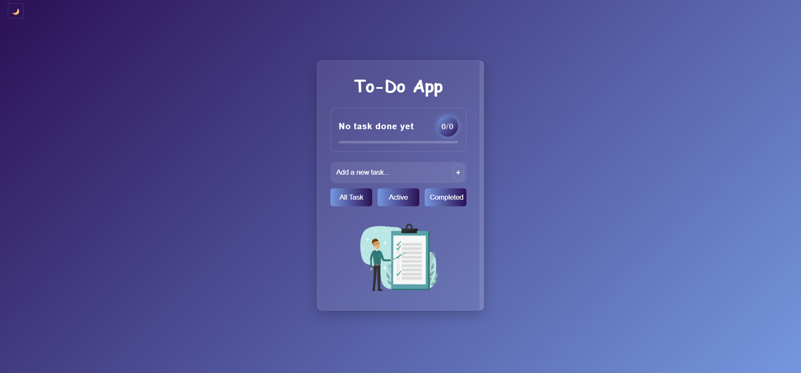

# To-Do App

A clean, minimal and interactive Task Manager built using HTML, CSS, and JavaScript — with smooth animations, pop effects, and It allows users to add tasks, mark them as completed, delete them and store them using localStorage.

## Features

### Add Task
- Quickly add any task using input bar

### Mark as Completed
- Checkbox to mark test as complete
- Strikethrough + faded look when completed
- Used for filtering Active/Completed tasks

### Active / Completed / All Filter
#### Button filters:
- **All** : Shows every task
- **Active** : Shows Unchecked tasks
- **Completed** : Shows only finished tasks

### Progress Tracker
- Percentage of task completed
- A progress bar that expands based on completion
- Live update whenever a task is added or completed
- **Progress message** appears above the bar
- perfect for user to visualize productivity

### Delete Icon / Edit Icon
- User can easily edit and remove any task 

### Empty-State Image
- when there are **no tasks** a friendly illustration image is shown to indicate empty state.

### UI & Animations
- Pop animation on button
- Styled scrollbar that matches the theme
- Soft shadows and glass-like card UI

### Local Storage Support
- Task stay saved even after refreshing the page
- Check status also remains saved

## Tech Stack

- HTML5
- CSS3
- JAVASCRIPT

## Structure
```
 TodoApp/
│
├── src/
│   ├── man-working-checklist-background.png
│   ├── light-mode.png
│   └── dark-mode.png
│
├── todo.html
├── todo.css
├── todo.js
└── README.md
 ```
 
## How to Use
- Type a task
- Click Add Icon
- Check task to complete
- Filter using Active / Completed / All
- Switch light / dark themes
- Watch your progress grow!

## Screenshots

### Dark Mode


### Light Mode


### Empty State


## Installation

1. **Clone the repo**
```bash
git clone https://github.com/sneha-20-singh/TodoApp.git
```
2. **Open the project**

-  Open todo.html in your browser.

## License
- This project is open source and free to use

## Contributing
- Feel free to open issues or submit pull requests!

--- 


<div align="center">
 Support This Project ❤️  


If you found this To-Do App interesting, please consider giving it a ⭐ 

    Made with ❤️ by Sneha Singh

</div>


